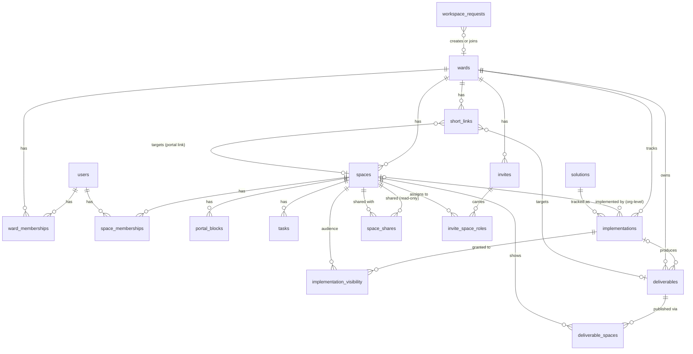

# Wardest.com — Data Model

The runnable DDL is in [`db/schema.sql`](db/schema.sql); this file is the rationale, the
diagram, and the audit trail of how the open design questions were resolved. Everything here
derives from [`BLUEPRINT.md`](BLUEPRINT.md).

> Reviewed: drafted by Opus 4.8, audited by Fable 5 (July 2026), resolutions confirmed by the
> owner. The "Resolved questions" section below records what changed and why.

## Conventions

- **IDs**: app-generated `TEXT` (ULID/UUID). Portable across environments; no reliance on
  autoincrement.
- **Timestamps**: `TEXT` ISO-8601 UTC (`datetime('now')`).
- **Booleans**: `INTEGER` 0/1. **Enums**: `TEXT` + `CHECK`.
- **Tenancy**: every ward-scoped table carries `ward_id` (row-level multi-tenancy — one DB,
  filter by `ward_id`). Only `users` and `solutions` are global. Child tables denormalize
  `ward_id` so every tenant query filters on a local column without a join.
- **Foreign keys**: D1 **enforces** FK constraints by default (equivalent to
  `PRAGMA foreign_keys = on`; cannot be disabled, only deferred per-transaction via
  `PRAGMA defer_foreign_keys`). Tables are declared in dependency order; migrations that
  need to reshape tables can defer within their transaction.

## Entity diagram

## Tables at a glance

| Table | Purpose |
|---|---|
| `users` | Google-identified people; may belong to multiple wards |
| `solutions` | Global catalog **and** the submission pipeline (one table, keyed by `status`) |
| `workspace_requests` | Request→approve gate: `create` a new ward (operator reviews) or `join` an existing one after unit-number dedupe (that ward's superadmins review) |
| `wards` | The tenant; `unit_number` dedupes, `prefix` namespaces go4.cc links |
| `ward_memberships` | user↔ward + ward role (`superadmin`/`member`) |
| `spaces` | An audience (Public/Bishopric/Ward Council/org); the app-wide visibility primitive; also the portal (1:1); `archived` hides unused defaults |
| `space_memberships` | user↔space + space role (`owner`/`member`) |
| `space_shares` | Whole-space read-only sharing: members of another space may view this space's portal + contents |
| `portal_blocks` | Rich-text blocks on a portal |
| `tasks` | Lightweight self-archiving task list per space (optional assignee) |
| `implementations` | A ward's record of working a solution; `visibility` = `ward` or `restricted` |
| `implementation_visibility` | Multi-valued audience grants for `restricted` tracker entries |
| `deliverables` | The output (url/file/image); tied to an implementation or ad-hoc; 1 implementation : N deliverables |
| `deliverable_spaces` | Publishing layer: which spaces show a deliverable + portal inclusion/order |
| `short_links` | go4.cc slugs → destinations (D1 = source of truth; KV mirror for redirects); `target_*` is the only linkage — no back-references |
| `invites` / `invite_space_roles` | Callings-chart invites → materialize into memberships |

## Key design decisions

1. **Row-level tenancy, one database.** No per-ward DBs. `ward_id` everywhere ward-scoped.
2. **Spaces are the single visibility primitive.** Deliverable visibility = which spaces it's
   published into (`deliverable_spaces`). Tracker visibility = `implementations.visibility`
   (`ward` = all ward members) plus multi-valued grants (`implementation_visibility`) for
   `restricted` entries. Whole-space read-only sharing = `space_shares` (e.g. Activities
   Committee shares its portal with Ward Council and Bishopric). No parallel permission systems;
   shares and grants only ever *widen* from fail-closed defaults, and neither chains
   transitively.
3. **Ownership vs. visibility split.** `created_by_user_id` on deliverables/tasks encodes the
   "only the creator edits/deletes" rule (app-enforced); space membership encodes visibility.
4. **Implementations are ward-scoped with an optional implementing space.** `space_id` NULL =
   ward-level (`ward_singleton` solutions: Exec Sec, Ward Clerk, Bishopric categories); set =
   that org's own copy (`per_space` solutions). Uniqueness via two partial indexes. Catalog
   *category* is shelving only — audience always comes from spaces.
5. **Deliverables have a separate publishing layer** (`deliverable_spaces`) so one artifact can
   appear in several portals with independent include/order.
6. **The shortener is D1-backed for truth, KV-backed for speed.** `short_links` is authoritative;
   a KV mirror (`slug -> destination`) serves edge redirects. QR codes are **derived** (SVG at
   render), never stored. Short links point at their targets via `target_*`; nothing points back
   (single source of truth for the relationship).
7. **Invites carry future memberships.** People added via the callings chart don't exist as
   `users` until they log in with Google, so `invites` (+ `invite_space_roles`) hold the intended
   ward/space roles and materialize on acceptance.
8. **Stateless sessions.** Signed cookie, short TTL, no sessions table. Authorization is
   re-checked against D1 per request, so a stale cookie only affects identity, never roles.

## Resolved questions (audit trail)

**#1 — Implementation scope → ward-scoped, nullable `space_id`.** Space-scoping forced every
Exec-Sec/Ward-Clerk solution to name an "owning space" that doesn't exist. Now: NULL = ward-level,
set = org-level (`per_space`). Enforced by partial unique indexes `ux_impl_ward` / `ux_impl_space`.

**#2 — Category→space mapping → dissolved.** With #1, no mapping is needed. Category is catalog
shelving; audiences come from spaces.

**#3 — Tasks → confirmed.** Per-space grain (spaces:portals are 1:1), optional `assignee_user_id`.

**#4 — Tracker visibility → per-entry, multi-valued.** Owner ruling (two rounds): NOT blanket
ward-wide — some Bishopric implementations must be Bishopric-only, others visible to Ward Council
or everyone — and a single visibility space is not enough (an entry may be shared with several
audiences at once). Model: `implementations.visibility` (`ward` | `restricted`, fail-closed
default `restricted`) + `implementation_visibility` grant rows. A `restricted` entry is visible to
its owner, its implementing space (members + `space_shares` viewers), and each granted space's
direct members. Deleting a grant/share only narrows visibility, so CASCADE deletes are safe
(the earlier single-column RESTRICT rationale no longer applies). App defaults: `per_space` →
`restricted`; `ward_singleton` → `ward`; owner can change.

**Owner addition — whole-space sharing (`space_shares`).** A space's owners can share the space
read-only with other spaces (Activities Committee → Ward Council, Bishopric). Viewers see the
portal + its contents but edit nothing. Not transitive; does not chain through grants.

**Owner addition — new categories/default spaces:** Activities Committee and Ward Mission join
the catalog category enum and the default space set.

**#5 — Sessions → stateless** (decision 8). Revisit only if "log out everywhere" is needed.

**#6 — D1 FK enforcement → corrected.** The draft claimed D1 doesn't reliably enforce FKs; per
current Cloudflare docs it **enforces them always** (only per-transaction deferral exists). The
`NOT NULL + ON DELETE SET NULL` contradiction on `deliverables.created_by_user_id` (which would
have made user deletion throw) is fixed to `ON DELETE RESTRICT`.

**#7 — Deliverables per implementation → 1:N confirmed** (e.g. URL + printable PDF from one
solution).

**Audit additions:** `spaces.archived` (blueprint §6 "hide" was unrepresentable);
`workspace_requests.kind` `create`/`join` + `target_ward_id` (blueprint §9 "request to join" was
unrepresentable); dropped `spaces.is_public` (duplicated `kind='public'`), dropped
`spaces.portal_short_link_id` and `deliverables.short_link_id` (bidirectional duplication +
circular FK; `short_links.target_*` is the single direction).

## App-layer rules the schema can't express (enforce in code)

- Only the creator edits/deletes their deliverables/tasks — **except a ward superadmin**, who
  can edit/delete anything in their ward (break-glass).
- Visibility resolution (the canonical check — implement once, in one place):
  - `canViewSpaceContent(u, s)` = member of `s`, OR `s.kind='public'`, OR member of any space
    `s` is shared with via `space_shares`, OR **a superadmin of `s`'s ward (break-glass)**.
  - `canViewImplementation(u, i)` = **superadmin of `i.ward_id` (break-glass)**, OR if
    `i.visibility='ward'` → any member of `i.ward_id`; else → `u` is `i.owner_user_id`, OR
    (`i.space_id` set AND `canViewSpaceContent(u, i.space_id)`), OR direct member of any space
    granted in `implementation_visibility`.
  - No transitive chaining: shares don't extend grants; shares of shares grant nothing.
  - **Ward superadmin = break-glass:** can view AND manage everything within their ward
    (including org spaces they don't belong to). Scope is limited to what Wardest stores — it
    does NOT grant access to a link's destination (e.g. a Google Doc keeps its own permissions).
    A ward must always keep ≥1 superadmin; superadmins can grant/revoke the role to other members.
- Only space owners (or a ward superadmin) manage that space's `space_shares` and portal content.
- `implementation_scope` ⇒ `space_id` NULL-ness; `per_space` must reference an `org`-kind space.
- `workspace_requests`: `ward_name` required when `kind='create'`; `target_ward_id` when `'join'`.
- Re-invites UPDATE the existing `invites` row (UNIQUE(ward_id, email)).
- On login, refresh `users.email`/`name` from Google claims keyed on `google_sub`.
- Slug normalization: short-link slugs lowercased and ward-prefix-namespaced on write.

## Not modeled yet (deferred, by design)

- **Callings default template** as a reference table — `calling_title` is free text, with the
  standard LDS org set shipped as seed data.
- **Audit log** of who-changed-what — `created_by`/timestamps only for now.
- **Click analytics** on short links, **email/notification** records beyond `invites`,
  **per-ward theming** of portals.
